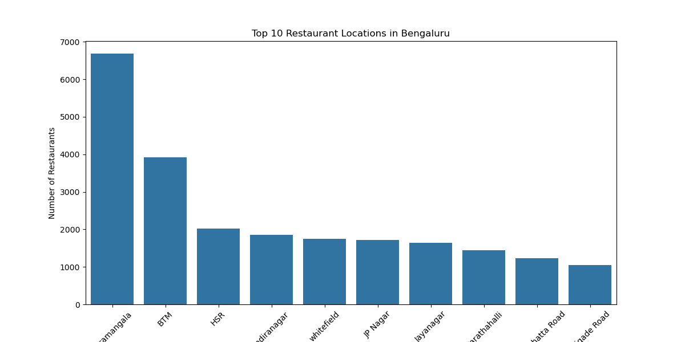

# Zomato Bangalore Restaurant Analysis

## Project Overview

This project is an end-to-end data analysis of the Zomato restaurant dataset for Bengaluru. The primary goal is to perform data cleaning and exploratory data analysis (EDA) to uncover insights about the restaurant landscape in the city. This project showcases skills in data cleaning, data manipulation, statistical analysis, and data visualization using Python and Tableau.

---

## Interactive Dashboard

An interactive dashboard summarizing the key findings was built using Tableau Public.

[**View the Live Dashboard Here**](https://public.tableau.com/app/profile/aryan.raj1267/viz/ZomatoBangaloreAnalysis_17594187976560/Dashboard1)

---

## Key Questions Answered

1.  Which locations in Bengaluru have the highest concentration of restaurants?
2.  Is there a statistically significant difference in ratings for restaurants that offer online ordering versus those that do not?
3.  What is the distribution of online ordering and table booking availability?

---

## Key Findings & Visualizations

### 1. Top 10 Restaurant Locations in Bengaluru

The analysis revealed that Koramangala, BTM, and HSR are the top three locations with the highest number of restaurants, indicating a highly saturated market in these areas.

### 2. Impact of Online Ordering on Restaurant Ratings

A statistical analysis was performed to compare the average ratings of restaurants that offer online ordering against those that do not. The findings show that restaurants with online ordering have a statistically significant higher average rating, suggesting a positive correlation between this feature and customer satisfaction.

---

## Tools & Libraries Used

* **Python**
* **Pandas** (for data manipulation and cleaning)
* **NumPy** (for numerical operations)
* **Matplotlib & Seaborn** (for data visualization)
* **Tableau** (for BI Dashboarding)
* **Git & GitHub** (for version control)
* **Jupyter Notebook** (as the development environment)
